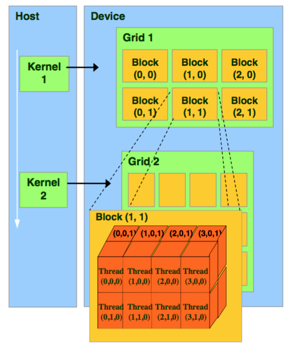

# Chapter 2. Programming Model

## 2.1 Kernels
kernels are extended C++ functions which can be running on CUDA device.

```c++
// Kernel definition
__global__ void VecAdd(float* A, float* B, float* C)
{
    int i = threadIdx.x;
    C[i] = A[i] + B[i];
}

int main()
{
    ...
    VecAdd<<<1, N>>>(A, B, C);
    ...
}

```
A kernel is defined using the <code>\_\_global__</code> declaration specifier; and using <<<...>>> to specify thresh number.

## 2.2 Thread Hierarchy


A CUDA device can have multiple thread grid, a thread grid is composed of thread blocks that index by two-dimensional array. A thread block composed of multiple thread, and there are three types of thread block: **one-dimensional** thread block, **two-dimensional** thread block and **three-dimensional** thread block.

For a one-dimensional thread block the thread ID equals <code>x</code>; for a two-dimensional thread block of size $(D_x, D_y)$ the thread ID of index (x, y) equals $x + y * D_x$; for a three-dimensional thread block of size $(D_x, D_y, D_z)$ the thread ID of index (x, y, x) equals $x + y * D_x + z * D_x * D_y$.

```c++

void main()
{
    // create a one-dimensional grid with one-dimensional blocks
    int numBlocks = 1;
    int threadPreBlock = 128;
    FooKernel<<<numBlocks, threadPreBlock>>>(A, B);

    // create a one-dimensional grid with two-dimensional blocks
    dim3 blockShape = dim3(32, 32); # thread number is 32 * 32 * 1
    FooKernel<<<numBlocks, blockShape>>>(A, B);

    // create a two-dimensional grid with two-dimensional blocks
    dim3 gridShape = dim3(3, 2);
    dim blockShape = dim3(2, 3);
    FooKernel<<<gridShape, blockShape>>>(A, B);
}

```

# 2.3 Memory Hierarchy
